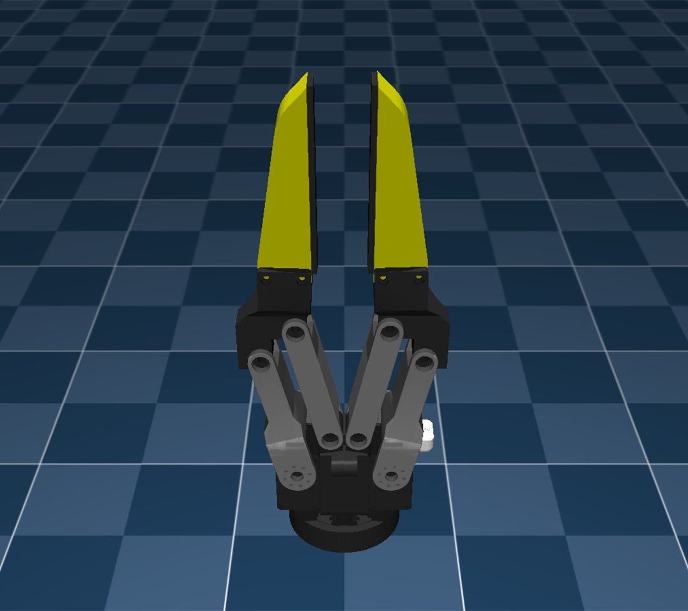

# LEGATO Gripper Models



## Overview
This branch contains simplified [MJCF](mjcf/LEGATO.xml) and [URDF](urdf/LEGATO.urdf) models of the LEGATO Gripper, developed as part of <i>[LEGATO: Cross-Embodiment Imitation Using a Grasping Tool](https://ut-hcrl.github.io/LEGATO)</i>. If you find our work useful in your research, please consider [citing](#citing).


## Usage
The MJCF and URDF models use consistent joint and link naming conventions. For the closed-loop kinematics of the four-bar linkages, constraints must be created to connect `joint_right_driver` with `joint_right_finger` on the right side and `joint_left_driver` with `joint_left_finger` on the left. While the MJCF model includes these kinematic chains, the URDF model does not implement these constraints. Users working with the URDF model must create constraints manually, for instance, using the `createConstraint` function in PyBullet.

For simulation, it is recommended to actuate the `joint_right_driver` within the range of (-0.5\pi, 0) and the `joint_left_driver` within the range of (0, 0.5\pi). Each joint moves in opposite directions, with full closure at 0 and full opening at -0.5\pi for the right and 0.5\pi for the left. Because the fingertips are inward when fully closed, it is preferable to start the simulation with the Gripper slightly open, such as at -0.25\pi for the right and 0.25\pi for the left. The MJCF model includes actuator models that allow control through `torque_right_drive` and `torque_left_drive`.

The MJCF model has been tested on MuJoCo versions 2.3.0 and 3.2.5, while the URDF model has been tested on PyBullet version 3.2.6.


## License
LEGATO is released under the [MIT License](LICENSE). For questions, please contact [Mingyo Seo](https://mingyoseo.com).


## Citing
```
@misc{seo2024legato,
    title={LEGATO: Cross-Embodiment Imitation Using a Grasping Tool},
    author={Seo, Mingyo and Park, H. Andy and Yuan, Shenli and Zhu, Yuke and
          and Sentis, Luis},
    year={2024}
    eprint={2411.03682},
    archivePrefix={arXiv},
    primaryClass={cs.RO}
}
```